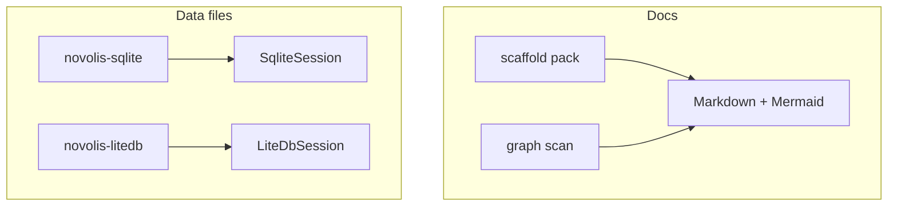

<!-- novolis-marketing:start -->
<p align="center">
  <a href="https://github.com/Novolis-Platform">
    
  </a>
</p>

<p align="center">
  
</p>

<p align="center">
  <strong>Maintainer CLIs and docs site</strong><br/>
  Maintainer tools: novolis-docs site builder, SQLite/LiteDB CLIs, and helpers.
</p>

<p align="center">
  <a href="https://novolis-platform.github.io/.github/novolis-tools/"></a>
  <a href="https://github.com/Novolis-Platform/novolis-tools/actions"></a>
  <a href="https://github.com/orgs/Novolis-Platform/packages?repo_name=novolis-tools"></a>
  <a href="https://github.com/Novolis-Platform"></a>
</p>

<p align="center">
  <a href="https://novolis-platform.github.io/.github/novolis-tools/">Docs</a>
  ·
  <a href="https://nuget.pkg.github.com/Novolis-Platform/index.json"><code>https://nuget.pkg.github.com/Novolis-Platform/index.json</code></a>
  ·
  <a href="https://github.com/Novolis-Platform/.github/blob/main/profile/README.md">Org landing</a>
  ·
  <a href="https://github.com/Novolis-Platform/novolis-governance">Governance</a>
</p>

---
<!-- novolis-marketing:end -->
<!-- novolis-package-index:start -->
> **GitHub Packages shows this repository README on every package page** (upstream limitation).
> Open the **package README** for install and quick start — embedded in each .nupkg and linked below.

## Published packages

| Package | Install | Package README |
|---------|---------|----------------|
| `Novolis.Install` | `dotnet add package Novolis.Install` | [README](https://github.com/Novolis-Platform/novolis-tools/blob/main/src/Novolis.Install/README.md) |
| `Novolis.Manuscript.Cli` | `dotnet add package Novolis.Manuscript.Cli` | [README](https://github.com/Novolis-Platform/novolis-tools/blob/main/src/Novolis.Manuscript.Cli/README.md) |
| `Novolis.Tools.Cli` | `dotnet add package Novolis.Tools.Cli` | [README](https://github.com/Novolis-Platform/novolis-tools/blob/main/src/Novolis.Tools.Cli/README.md) |
| `Novolis.Tools.Coverage` | `dotnet add package Novolis.Tools.Coverage` | [README](https://github.com/Novolis-Platform/novolis-tools/blob/main/src/Novolis.Tools.Coverage/README.md) |
| `Novolis.Tools.Coverage.Cli` | `dotnet add package Novolis.Tools.Coverage.Cli` | [README](https://github.com/Novolis-Platform/novolis-tools/blob/main/src/Novolis.Tools.Coverage.Cli/README.md) |
| `Novolis.Tools.Docs` | `dotnet add package Novolis.Tools.Docs` | [README](https://github.com/Novolis-Platform/novolis-tools/blob/main/src/Novolis.Tools.Docs/README.md) |
| `Novolis.Tools.Docs.Cli` | `dotnet add package Novolis.Tools.Docs.Cli` | [README](https://github.com/Novolis-Platform/novolis-tools/blob/main/src/Novolis.Tools.Docs.Cli/README.md) |
| `Novolis.Tools.LiteDb` | `dotnet add package Novolis.Tools.LiteDb` | [README](https://github.com/Novolis-Platform/novolis-tools/blob/main/src/Novolis.Tools.LiteDb/README.md) |
| `Novolis.Tools.LiteDb.Cli` | `dotnet add package Novolis.Tools.LiteDb.Cli` | [README](https://github.com/Novolis-Platform/novolis-tools/blob/main/src/Novolis.Tools.LiteDb.Cli/README.md) |
| `Novolis.Tools.MarkdownPdf` | `dotnet add package Novolis.Tools.MarkdownPdf` | [README](https://github.com/Novolis-Platform/novolis-tools/blob/main/src/Novolis.Tools.MarkdownPdf/README.md) |
| `Novolis.Tools.MarkdownPdf.Cli` | `dotnet add package Novolis.Tools.MarkdownPdf.Cli` | [README](https://github.com/Novolis-Platform/novolis-tools/blob/main/src/Novolis.Tools.MarkdownPdf.Cli/README.md) |
| `Novolis.Tools.Sqlite` | `dotnet add package Novolis.Tools.Sqlite` | [README](https://github.com/Novolis-Platform/novolis-tools/blob/main/src/Novolis.Tools.Sqlite/README.md) |
| `Novolis.Tools.Sqlite.Cli` | `dotnet add package Novolis.Tools.Sqlite.Cli` | [README](https://github.com/Novolis-Platform/novolis-tools/blob/main/src/Novolis.Tools.Sqlite.Cli/README.md) |
| `Novolis.Xsd.Tool` | `dotnet add package Novolis.Xsd.Tool` | [README](https://github.com/Novolis-Platform/novolis-tools/blob/main/src/Novolis.Xsd.Cli/README.md) |

For NuGet.org and Visual Studio, the **embedded** README.md inside each package is authoritative.

<!-- novolis-package-index:end -->
# novolis-tools

Developer tools for Novolis workspaces. Prefer **Markdown with Mermaid** for documentation and relationship graphs. Database CLIs sit on the matching **Storage** packages so engine versions stay aligned with application hosts.



## Packages

| Package | Role |
|---------|------|
| `Novolis.Tools.Cli` | Shared Spectre chrome (tables, help, open guards) |
| `Novolis.Tools.Coverage` | MTP Cobertura collection + ReportGenerator merge |
| `Novolis.Tools.Coverage.Cli` | `novolis-coverage` tool |
| `Novolis.Tools.Docs` | Markdown / Mermaid / `.csproj` relationship graphs |
| `Novolis.Tools.Docs.Cli` | `novolis-docs` tool |
| `Novolis.Tools.Sqlite` | SQLite session helpers (`Novolis.Storage.Sqlite`) |
| `Novolis.Tools.Sqlite.Cli` | `novolis-sqlite` Spectre REPL |
| `Novolis.Tools.LiteDb` | LiteDB session helpers (`Novolis.Storage.LiteDb`) |
| `Novolis.Tools.LiteDb.Cli` | `novolis-litedb` Spectre REPL |
| `Novolis.Tools.MarkdownPdf` | Markdown → PDF themes over Documents.Skia |
| `Novolis.Tools.MarkdownPdf.Cli` | `novolis-mdpdf` tool (`themes` / `convert`) |
| `Novolis.Manuscript.Cli` | `novolis-manuscript` manuscript surgery, metrics, print, and audiobook commands |
| `Novolis.Xsd.Tool` | `novolis-xsd` XSD / UBL / Peppol source generation |
| `Novolis.Install` | `novolis` registry search, diagnostics, and package lifecycle command |

## Quick start

```powershell
dotnet run --project d:\novolis\novolis-tools\src\Novolis.Tools.Docs.Cli -- scaffold --title "Demo" --out d:\temp\demo-docs
dotnet run --project d:\novolis\novolis-tools\src\Novolis.Tools.Docs.Cli -- graph --root d:\novolis\novolis-tools --out d:\temp\tools-graph
dotnet run --project d:\novolis\novolis-tools\src\Novolis.Tools.MarkdownPdf.Cli -- themes
dotnet run --project d:\novolis\novolis-tools\src\Novolis.Tools.MarkdownPdf.Cli -- convert --in D:\path\file.md --theme trade
dotnet run --project d:\novolis\novolis-tools\src\Novolis.Tools.Coverage.Cli -- collect --platform --skip-build --fail-below -1 --out d:\novolis\coverage
dotnet run --project d:\novolis\novolis-tools\src\Novolis.Tools.Sqlite.Cli -- :memory: -c "SELECT 'ok' AS status;"
dotnet run --project d:\novolis\novolis-tools\src\Novolis.Tools.LiteDb.Cli -- :memory: -c "INSERT INTO t VALUES {_id: 1, status: \"ok\"}; SELECT $ FROM t;"
dotnet run --project d:\novolis\novolis-tools\src\Novolis.Manuscript.Cli -- book list-books --workspace D:\repos\books
dotnet run --project d:\novolis\novolis-tools\src\Novolis.Xsd.Cli -- --help
dotnet run --project d:\novolis\novolis-tools\src\Novolis.Install -- doctor
```

## Build

```powershell
dotnet build d:\novolis\novolis-tools\Novolis.Tools.slnx
dotnet test d:\novolis\novolis-tools\Novolis.Tools.slnx
```

## Docs

- [Getting started](docs/getting-started.md)
- [Design](docs/design.md)
- [Release](docs/release.md)

