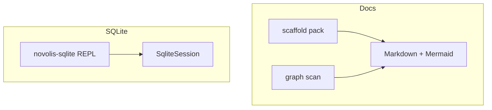

<!-- novolis-marketing:start -->
<p align="center">
  <a href="https://github.com/Novolis-Platform">
    
  </a>
</p>

<p align="center">
  <strong>Developer CLI tools</strong><br/>
  Markdown + Mermaid documentation packs, relationship graphs, SQLite REPL, and more.
</p>

<p align="center">
  <a href="https://github.com/Novolis-Platform/novolis-tools/actions"></a>
  <a href="https://github.com/orgs/Novolis-Platform/packages?repo_name=novolis-tools"></a>
  <a href="https://github.com/Novolis-Platform"></a>
</p>

<p align="center">
  <a href="https://nuget.pkg.github.com/Novolis-Platform/index.json"><code>https://nuget.pkg.github.com/Novolis-Platform/index.json</code></a>
  ·
  <a href="https://github.com/Novolis-Platform/.github/blob/main/profile/README.md">Org landing</a>
  ·
  <a href="https://github.com/Novolis-Platform/novolis-governance">Governance</a>
</p>

---
<!-- novolis-marketing:end -->
<!-- novolis-package-index:start -->
> **GitHub Packages shows this repository README on every package page** (upstream limitation).
> Open the **package README** for install and quick start — embedded in each .nupkg and linked below.

## Published packages

| Package | Install | Package README |
|---------|---------|----------------|
| `Novolis.Tools.Docs` | `dotnet add package Novolis.Tools.Docs` | [README](https://github.com/Novolis-Platform/novolis-tools/blob/main/src/Novolis.Tools.Docs/README.md) |
| `Novolis.Tools.Docs.Cli` | `dotnet tool install -g Novolis.Tools.Docs.Cli` | [README](https://github.com/Novolis-Platform/novolis-tools/blob/main/src/Novolis.Tools.Docs.Cli/README.md) |
| `Novolis.Tools.Sqlite` | `dotnet add package Novolis.Tools.Sqlite` | [README](https://github.com/Novolis-Platform/novolis-tools/blob/main/src/Novolis.Tools.Sqlite/README.md) |
| `Novolis.Tools.Sqlite.Cli` | `dotnet tool install -g Novolis.Tools.Sqlite.Cli` | [README](https://github.com/Novolis-Platform/novolis-tools/blob/main/src/Novolis.Tools.Sqlite.Cli/README.md) |

<!-- novolis-package-index:end -->
# novolis-tools

Developer tools for Novolis workspaces. Prefer **Markdown with Mermaid** for documentation and relationship graphs; keep CLIs small and packable.



## Packages

| Package | Role |
|---------|------|
| `Novolis.Tools.Docs` | Markdown / Mermaid / `.csproj` relationship graphs |
| `Novolis.Tools.Docs.Cli` | `novolis-docs` tool |
| `Novolis.Tools.Sqlite` | SQLite session helpers |
| `Novolis.Tools.Sqlite.Cli` | `novolis-sqlite` tool |

## Quick start

```powershell
dotnet run --project d:\novolis\novolis-tools\src\Novolis.Tools.Docs.Cli -- scaffold --title "Demo" --out d:\temp\demo-docs
dotnet run --project d:\novolis\novolis-tools\src\Novolis.Tools.Docs.Cli -- graph --root d:\novolis\novolis-tools --out d:\temp\tools-graph
dotnet run --project d:\novolis\novolis-tools\src\Novolis.Tools.Sqlite.Cli -- :memory: -c "SELECT 'ok' AS status;"
```

## Build

```powershell
dotnet build d:\novolis\novolis-tools\Novolis.Tools.slnx
dotnet test d:\novolis\novolis-tools\Novolis.Tools.slnx
```

## Docs

- [Getting started](docs/getting-started.md)
- [Design](docs/design.md)
- [Release](docs/release.md)
