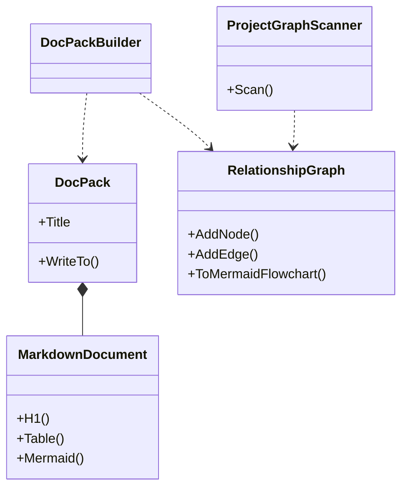
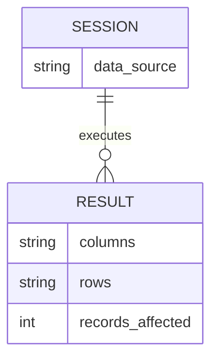

# Design

## Purpose

`novolis-tools` hosts small, packable developer CLIs and the libraries behind them. First wave:

1. **Docs** — Markdown documentation packs that use Mermaid for every structural claim (layers, edges, ER, mindmaps).
2. **SQLite** — a lightweight REPL over `Microsoft.Data.Sqlite` for local inspection and scripting.

```mermaid
flowchart LR
  docsCli["novolis-docs"] --> docsLib["Novolis.Tools.Docs"]
  sqliteCli["novolis-sqlite"] --> sqliteLib["Novolis.Tools.Sqlite"]
  docsLib --> md["MarkdownDocument"]
  docsLib --> mermaid["MermaidDiagram"]
  docsLib --> graph["RelationshipGraph"]
  sqliteLib --> session["SqliteSession"]
```

## Docs model



- **Scaffold** emits a starter pack (`overview`, `architecture`, `relationships`, `glossary`) with Mermaid stubs.
- **Graph** walks `.csproj` files, records ProjectReference / PackageReference edges, and emits the same pack shape filled from the scan.

Markdown is the durable artifact; Mermaid is the default way to show relationships (no ASCII boxes).

## SQLite model



Dot-commands (`.tables`, `.schema`, `.mode`, `.quit`) mirror the familiar `sqlite3` CLI surface without shipping the native binary.

## Non-goals (v0)

- Full static-site generators or HTML themes
- Replacing `novolis-governance` generators / org landing scripts
- ORM or migration tooling (use storage libraries for that)

## Future tools

Room for more CLIs in this repo (formatters, feed inspectors, workspace helpers) as separate `Novolis.Tools.*` packages — keep each tool packable and NuGet-only across repos.
