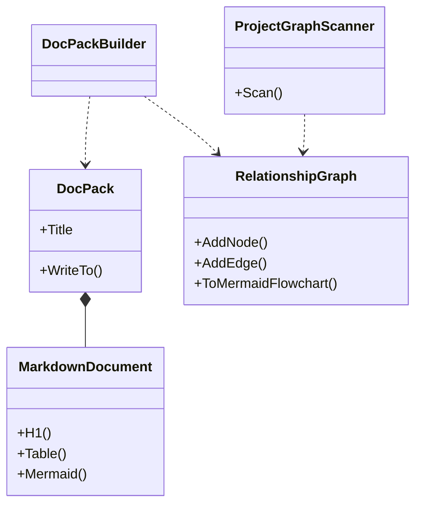
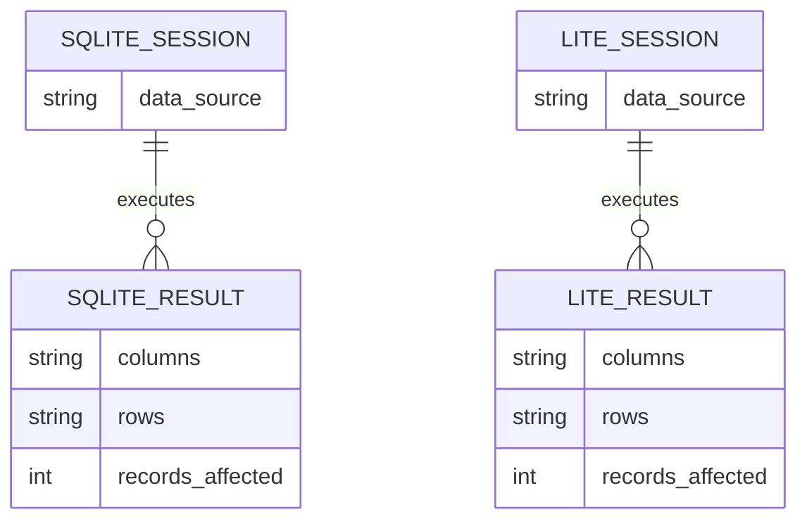

# Design

## Purpose

`novolis-tools` hosts small, packable developer CLIs and the libraries behind them. Current surface:

1. **Docs** — Markdown documentation packs that use Mermaid for every structural claim (layers, edges, ER, mindmaps).
2. **SQLite** — a lightweight REPL over the same engine as `Novolis.Storage.Sqlite`, for local inspection and scripting.
3. **LiteDB** — the document-store twin: shell SQL over the same engine as `Novolis.Storage.LiteDb`.

```mermaid
flowchart LR
  docsCli["novolis-docs"] --> docsLib["Novolis.Tools.Docs"]
  sqliteCli["novolis-sqlite"] --> sqliteLib["Novolis.Tools.Sqlite"]
  liteCli["novolis-litedb"] --> liteLib["Novolis.Tools.LiteDb"]
  docsLib --> md["MarkdownDocument"]
  docsLib --> mermaid["MermaidDiagram"]
  docsLib --> graph["RelationshipGraph"]
  sqliteLib --> sqliteSession["SqliteSession"]
  liteLib --> liteSession["LiteDbSession"]
  sqliteLib -.-> storageSqlite["Novolis.Storage.Sqlite"]
  liteLib -.-> storageLite["Novolis.Storage.LiteDb"]
```

Storage packages own persistence for applications (`IRepository{T}`, DI providers). Tools packages own **operator** surfaces: open the file, list structure, run ad-hoc statements, print a grid. They depend on the matching Storage package so engine versions and connection-string conventions stay aligned — they do not reimplement repositories.

## Docs model



- **Scaffold** emits a starter pack (`overview`, `architecture`, `relationships`, `glossary`) with Mermaid stubs.
- **Graph** walks `.csproj` files, records ProjectReference / PackageReference edges, and emits the same pack shape filled from the scan.

Markdown is the durable artifact; Mermaid is the default way to show relationships (no ASCII boxes).

## Database tools model



| Concern | SQLite | LiteDB |
|---------|--------|--------|
| Library | `Novolis.Tools.Sqlite` | `Novolis.Tools.LiteDb` |
| Tool | `novolis-sqlite` | `novolis-litedb` |
| Storage dep | `Novolis.Storage.Sqlite` | `Novolis.Storage.LiteDb` |
| Open shapes | path, `:memory:`, `SqliteOptions` | path, `:memory:`, `LiteDbOptions`, wrap `ILiteDatabase` |
| Structure | `.tables` / `ListTablesAsync` | `.collections` / `ListCollections` |
| Catalog | `.schema` via `sqlite_master` | `.indexes` via `$indexes` |
| Output | table, csv | table, csv, json lines |

Dot-commands stay deliberately small: enough to explore a file without becoming a second GUI.

## Non-goals (v0)

- Full static-site generators or HTML themes
- Replacing `novolis-governance` generators / org landing scripts
- ORM or migration tooling (use the Storage libraries for that)
- Competing with the native `sqlite3` binary or the LiteDB Studio GUI

## Future tools

Room for more CLIs in this repo (formatters, feed inspectors, workspace helpers) as separate `Novolis.Tools.*` packages — keep each tool packable and NuGet-only across repos.
